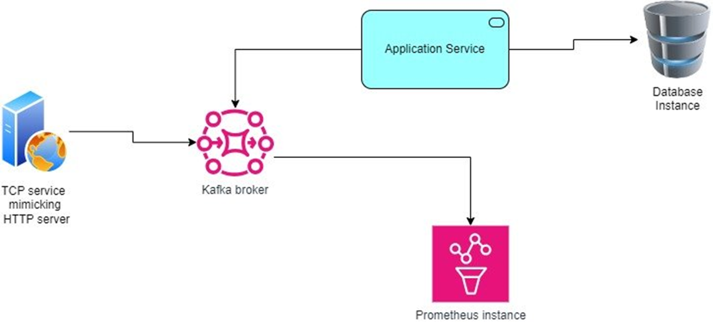

# Kafka 

## Introduction

This small project is a PoC of kafka messaging broker in Kraft mode, when some of the metrics are scraped to Prometheus

##  Topology

## Requirements

#### On your OS

You just need to have installed:

* Docker 
* Docker Compose
* OpenJDK 17+
* Maven

#### For the Java applications

Ensure that you have the follwing `maven` dependecies in your java applications:

    <dependency>
      <groupId>org.apache.kafka</groupId>
      <artifactId>kafka-clients</artifactId>
      <version>3.8.0</version>
      <scope>compile</scope>
    </dependency>
    <dependency>
        <groupId>org.slf4j</groupId>
        <artifactId>slf4j-simple</artifactId>
        <version>2.0.16</version>
        <scope>runtime</scope>
    </dependency>
    <dependency>
        <groupId>org.slf4j</groupId>
        <artifactId>slf4j-api</artifactId>
        <version>2.0.16</version>
        <scope>compile</scope>
    </dependency>
    

Make sure you use the latest version. Please refer to the public maven repository to get latest ones: https://mvnrepository.com/artifact/org.slf4j

## Create Kafka topic

Log into your container go to /opt folder and access kafka folder. The kafka-topics.sh script is located in the /bin  folder.

    ./kafka-topics.sh --create --topic my-topic --bootstrap-server localhost:9092

## Topic status

### Displaying messages

To see if the messages are being sent to the topic in Kafka `/bin`  folder run the following command: 

    ./kafka-console-consumer.sh --bootstrap-server localhost:9092 --topic my-topic --from-beginning

Specifying the partition

    ./kafka-console-consumer.sh --bootstrap-server localhost:9092 --topic my-topic --partition 0  --from-beginning

This will log real time messages/events being sent to your topic

### List topic

    ./kafka-topics.sh --bootstrap-server localhost:9092 --list

### Describe topic

    ./kafka-topics.sh --bootstrap-server localhost:9092 --describe --topic my-topic

## Prometheus integration

### On prometheus side

Add the prometheus configurtion

    scrape_configs:
    - job_name: kafka
        static_configs:
        - targets: ['kafka:9200']

### On Kafka side

Add the following environment variable on your container configuration:

    KAFKA_OPTS: -javaagent:/usr/share/jmx_exporter/jmx_prometheus_javaagent-0.20.0.jar=9200:/usr/share/jmx_exporter/kafka-broker.yml

## Configuration

Since we are using docker compose project there are some concepts to understand:
#### 1. KAFKA_LISTENERS: Where Kafka Binds and Listens

Purpose: This configuration tells Kafka on which network interfaces and ports it should listen for incoming connections.

Example (PLAINTEXT://0.0.0.0:9092):

`PLAINTEXT` specifies that the connection is unencrypted (no SSL).

`0.0.0.0` means Kafka will listen on all network interfaces on the machine/container, allowing connections from any IP address.

`9092` is the port Kafka is bound to.

In simple terms, KAFKA_LISTENERS defines where Kafka is available for incoming requests inside the container or machine.

#### 2. KAFKA_ADVERTISED_LISTENERS: How Kafka is Advertised to Clients

`Purpose`: This is the hostname or IP address that Kafka will give to clients when they request metadata about the cluster. Clients use this address to connect to the broker.

Example (PLAINTEXT://kafka:9092):

`PLAINTEXT` specifies an unencrypted connection.

`kafka` is the hostname that Kafka advertises to clients (the name of the service in your Docker Compose network).

`9092` is the port that clients will use to connect to the broker.

### Kraft mode

And since we are running it in Kraft mode (with no Zookeeper), aditional configs where added to the broker container as environment variables:
    
    KAFKA_NODE_ID: 1
    KAFKA_PROCESS_ROLES: broker,controller
    KAFKA_CONTROLLER_QUORUM_VOTERS: 1@localhost:9093 
    KAFKA_CONTROLLER_LISTENER_NAMES: CONTROLLER

## NOTE

You likely might find issues to create `topic` while the port 9200  of JMX to enable prometheus metrics  is enabled. This likely happens when you run it for first time.

`TIP`: To overcome that, disable(comment) everything related to prometheus, in your Kafka service inside of the docker compose file, commenting the following lines:

          # KAFKA_OPTS: -javaagent:/usr/share/jmx_exporter/jmx_prometheus_javaagent-0.20.0.jar=9200:/usr/share/jmx_exporter/kafka-broker.yml
          #      - "9200:9200" # to expose the port used by the JMX Prometheus java agent
          #       - ./jmx-exporter:/usr/share/jmx_exporter/

And then create the topic, once your topic is created you can then uncomment  the commented lines and spinup your docker services again. 

 

